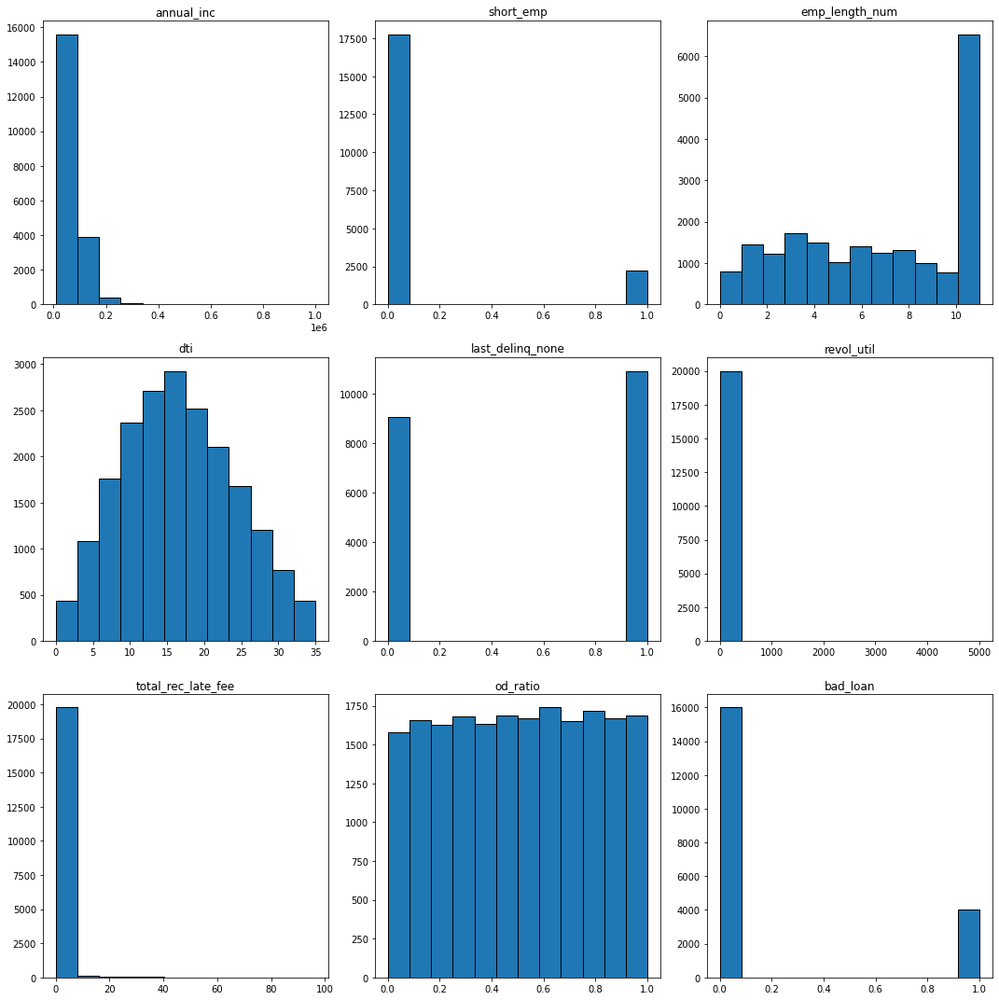
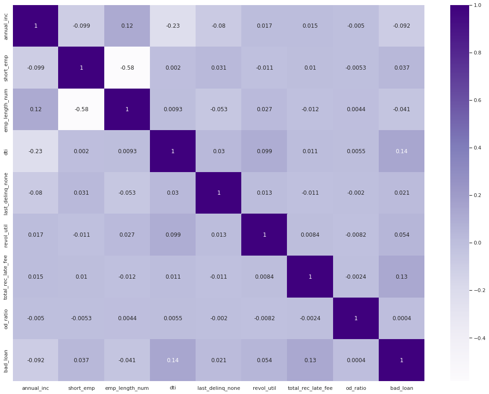
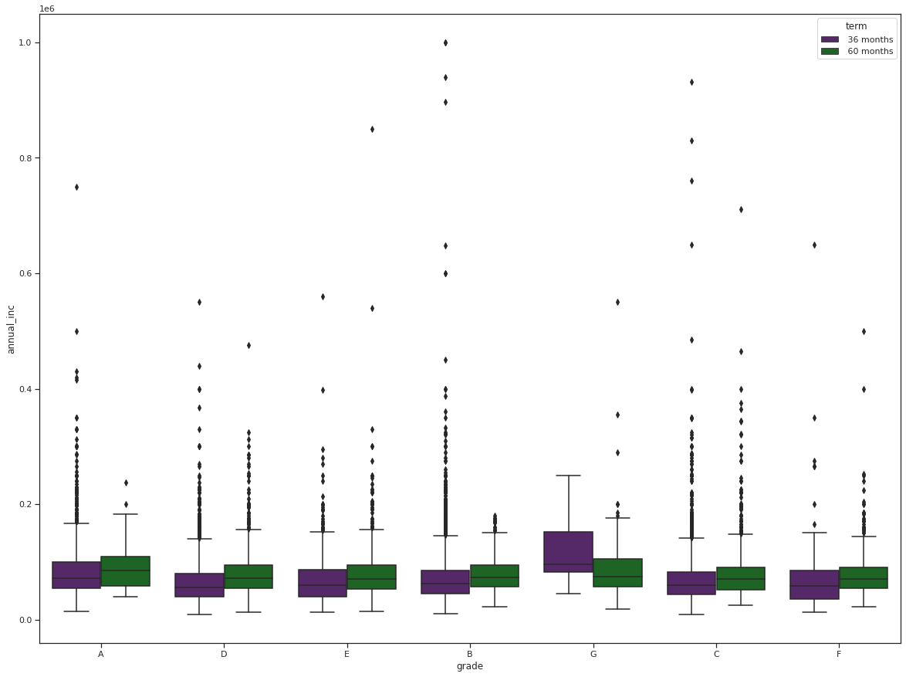
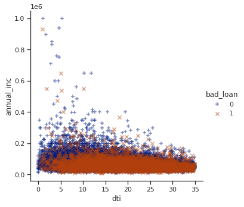
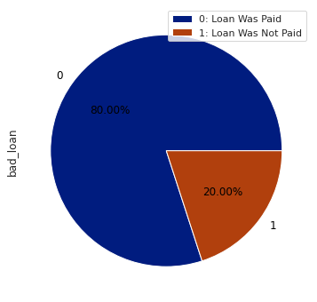

# Loan-Default-Prediction
## Predict Loan Default with Dataset

**Author**: Tyler Brown

### Business Problem:
Lending Club would like to predict the likelihood of customers defaulting on their loan using only the information provided in the dataset. Lending Club will be able to use the model metrics to determine how accurate the predictions are for future loan defaults.

### Data:
File lending_club_loan_dataset.csv within the repository contains data used for determining loan default predictions. The original data is provided by https://towardsdatascience.com/machine-learning-predicting-bank-loan-defaults-d48bffb9aee2
To help the Lending Club, my goal is to predict the "bad_loan" column. The remaining columns will be used to determine the prediction.

## Methods:
-The "last_major_derog_none" and "id'" columns were dropped from the dataset due to unique categorical values or too much missing data, which would cause errors in making predictions.

-Fill missing values in column "home_ownership" with the most frequent value 'MORTGAGE'. The percentage of data loss is high and would have a big impact on the results.

-Fill missing values in column "dti" with the mean numerical value of the column. The percentage of data loss is high and would have a big impact on the results.

-Column "term" contains inconsistent categories, where "36 Months" can translate to "36 months".

## Results:
#### Histogram of Numerical Columns

The graphs above show the count for all numerical data in the dataset. We can identify the outliers in these graphs by the difference of one value when compared to the other values.

#### Histogram of Categorical Columns

The graphs above show the count for all categorical data in the dataset. We can identify the outliers in these graphs by the difference of one value when compared to the other values.

#### Correlation between Target and Features

The heatmap above show the correlation between both the target and features in the dataset. We can see the greatest correlations between bad_loan and the features would be dti and total_rec_late_fee. Though these features are not significantly correlated to the target, they would affect the results of the target more than other features.

#### Grades and Annual Income Over Each Term

The boxplot above show the correlation between the annual income and grade features with each grade separated by terms. From the data, we can determine most of our data consists of customers with low annual incomes with a few outliers with high annual incomes of various grades.

#### Annual Income and DTI of Bad Loans

The scatterplot above shows the correlation between the debt-to-income and annual income features with each being marked based on those who defaulted on their loan. From the data, we can determine many low income customers defaulted on their loan no matter if their debt-to-income ratio is high or low. However, as the annual income increases, we can notice the debt-to-income is less and less customers defaulted on their loan. Stakeholders should be aware many of those with lower debt-to-income ratio and a higher salary will not default their loan.

#### Annual Income and DTI of Bad Loans

The pie chart above shows the percentage of defaulted loans based on the dataset. As we can see, 80% of customers paid their loan off, while 20% of customers did not pay their loan off. Stakeholders can use this data to identify a ratio of customers who pay their loan off or not.

## Recommendations:
From the Logistic Regression, KNN, and Random Forest models, the best machine learning model would be the Random Forest model with PCA because it maximized the predictive capability of the risk of future loan defaults. Though the false positives were high, the Random Forest model provided the highest number of true negatives, which minimizes false reports for Lending Tree. This way, Lending Tree can have a better probability to predict if borrowers will not pay and prevent the risk as much as possible.

## Limitations & Next Steps:
- Presented with missing values in the dataset
- No additional data is available for greater accuracy in predictions

The next steps would be to inform lending club on the results of predictions based on the dataset. If satisfied, the company can use these predictions and determine future value in loan defaults for the business.
If displeased, the comapny can make necessary arrangements to produce less loan defaults among their customers.

### For further information...
If there are any additional questions, I can be contacted at alpha.curse@gmail.com
